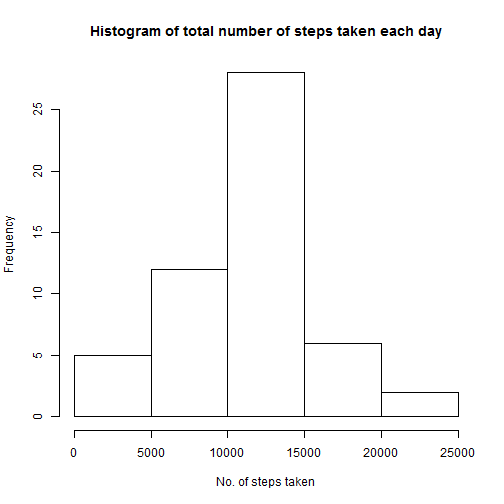
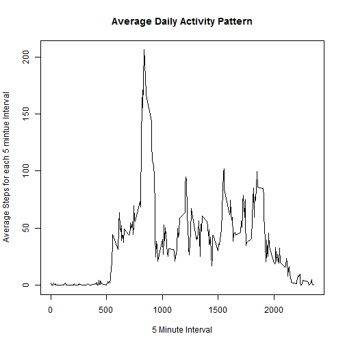
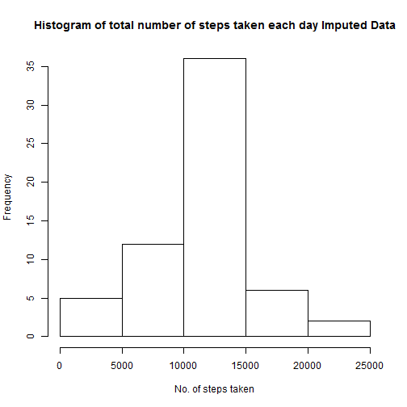
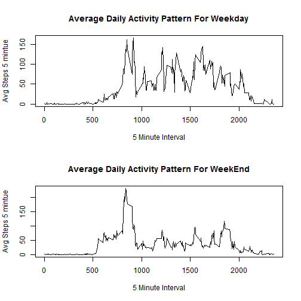

Reproducible Research
=========================================================================

This is my submission for Assignment 1.

##Reading From CSV and Transforming the Data

Here I transform all the date and interval to dateTime format as well.


```r
data<-read.csv("F:/My Folder/Studies/Analytics/R Working Directory/activity.csv")
data$TimeInHrs<-floor(data$interval/100)
data$TimeInMins<-(data$interval- data$TimeInHrs*100)
data$dateTime<-as.POSIXct(data$date)
data$dateTime<-data$dateTime+(data$TimeInHrs*60*60)+(data$TimeInMins*60)
data$date<-as.factor(data$date)
data<-data[-c(4,5)]
```

##Getting total no of steps per day

Here I get the mean total number of steps taken per day


```r
dataPerDay<-aggregate(cbind(steps) ~ date,sum,data = data)
hist(dataPerDay[,2],main = "Histogram of total number of steps taken each day", xlab = "No. of steps taken")
```

 

```r
meanPerDay<-mean(dataPerDay[,2])
medianPerDay<-median(dataPerDay[,2])
```

Hence the mean for all days is 1.0766189 &times; 10<sup>4</sup> and median for all days is 10765.

##Getting average daily activity pattern

Here I get the average daily activity pattern


```r
dataPer5Mins<-aggregate(cbind(steps) ~ interval,mean,data = data)
plot(x=dataPer5Mins$interval,y=dataPer5Mins$steps,xlab = "5 Minute Interval",ylab = "Average Steps for each 5 mintue Interval",main = "Average Daily Activity Pattern",type="l")
```

 

```r
MaxNoOFSteps<-max(dataPer5Mins[,2])
TimeForMaxSteps<-dataPer5Mins[which.max( dataPer5Mins[,2] ),1]
HourForMaxSteps<-floor(TimeForMaxSteps/100)
MinForMaxSteps<-TimeForMaxSteps-(HourForMaxSteps*100)
if(MinForMaxSteps<10)
{
  MinForMaxSteps=paste('0',MinForMaxSteps,sep="")
}
if(MinForMaxSteps>=10)
{
  MinForMaxSteps=as.character(MinForMaxSteps)
}
```

The time of day(5 minute interval) at which maximum steps are taken on an average is 8:35 of day which is 206.1698113.


##Imputing missing values

Here I will impute the missing values - I am using mean for that 5-minute interval across all other days


```r
for(i in 1:nrow(data))
{
  if(is.na(data[i,1])==TRUE)
  {
    data[i,1]<-dataPer5Mins[(dataPer5Mins[,1]==data[i,3]),2]
  }
}
dataPerDay1<-aggregate(cbind(steps) ~ date,sum,data = data)
hist(dataPerDay1[,2],main = "Histogram of total number of steps taken each day Imputed Data", xlab = "No. of steps taken")
```

 

```r
meanPerDay1<-mean(dataPerDay1[,2])
medianPerDay1<-median(dataPerDay1[,2])
diffInMeanPerDay<-meanPerDay1-meanPerDay
diffInMedianPerDay<-medianPerDay1-medianPerDay
```

Hence the mean for all days is 1.0766189 &times; 10<sup>4</sup> and median for all days is 1.0766189 &times; 10<sup>4</sup> for imputed data.

The difference between original and new(imputed) data for 
median->1.1886792
mean->0

##Differences in activity patterns between weekdays and weekends

Here I demonstrate differences in activity patterns between weekdays and weekends


```r
data$weekdayEnd<-ifelse(((weekdays(data$dateTime)=="Saturday")|(weekdays(data$dateTime)=="Sunday")),"Weekday","Weekend")

dataWeekdayAndEnd<-split(x = data,f = data$weekdayEnd)


dataPer5MinsWeekday<-aggregate(cbind(steps) ~ interval,mean,data = dataWeekdayAndEnd$Weekday)
dataPer5MinsWeekEnd<-aggregate(cbind(steps) ~ interval,mean,data = dataWeekdayAndEnd$Weekend)

par(mfrow=(c(2,1)))

plot(x=dataPer5MinsWeekday$interval,y=dataPer5MinsWeekday$steps,xlab = "5 Minute Interval",ylab = "Avg Steps 5 mintue",main = "Average Daily Activity Pattern For Weekday",type="l")

plot(x=dataPer5MinsWeekEnd$interval,y=dataPer5MinsWeekEnd$steps,xlab = "5 Minute Interval",ylab = "Avg Steps 5 mintue",main = "Average Daily Activity Pattern For WeekEnd",type="l")
```

 

This is the end of assignment
